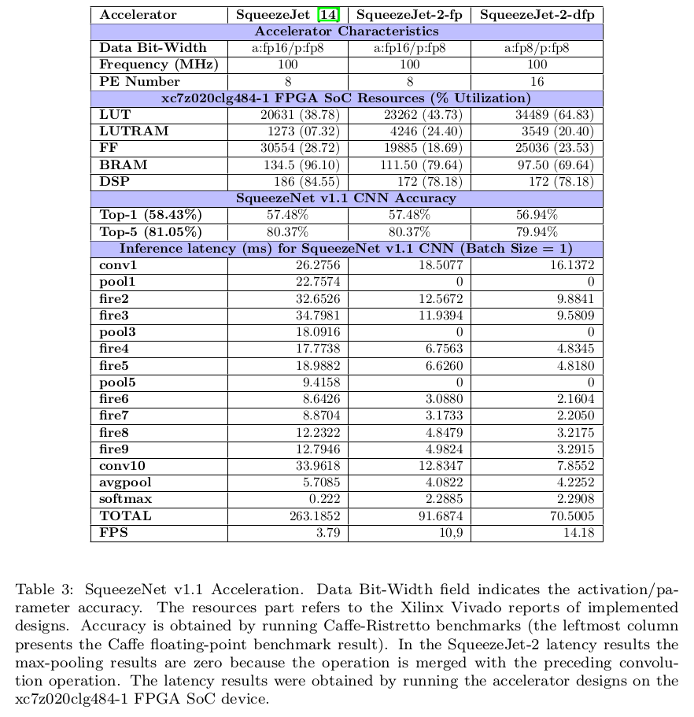
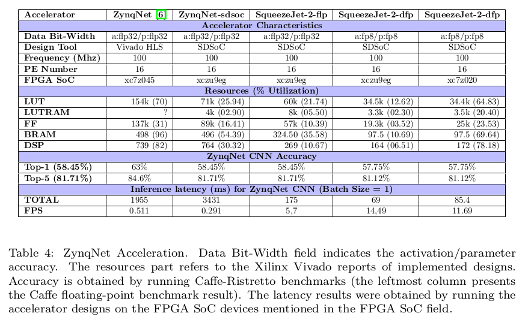
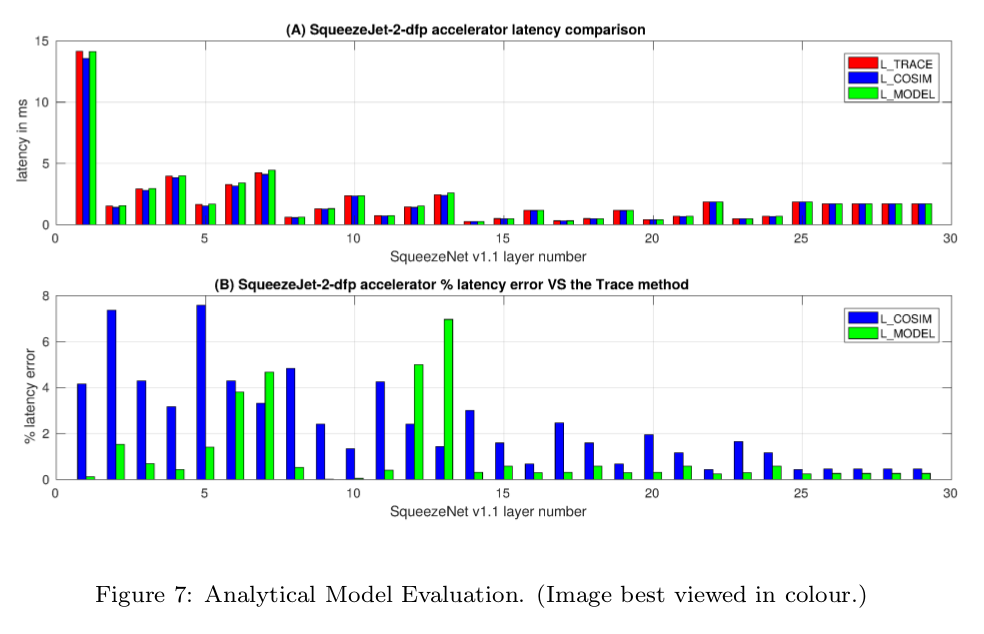

# CNN-Grinder


## About

CNN-Grinder is a template-driven workflow which can be used for converting algorithmic descriptions of mobile-friendly CNNs to high-level synthesis (HLS) C/C++ code for programming low-end-low-cost FPGA SoCs. HLS methods are used in order to accelerate the most typical layer types found in a CNN, such as the convolutional and the max pooling, and produce accelerated CNNs suitable for mobile embedded (edge) applications.

This project uses CNNs already optimized for mobile applications, such as the SqueezeNet v1.1 and the ZynqNet, and follows a methodology that will allow the mapping of the CNN onto the low-end-low-cost FPGA SoC. For this purpose, various software tools are used such as the following:

1. Caffe machine learning framework for getting the CNN model description and its parameters
2. Matcaffe Caffe interface for using Caffe inside Matlab
3. Matlab software tool for:
	* testing the custom CNN layer implementations against the Caffe's implementation
	* reshaping the CNN model parameters (data formating) in order to be suitable for HLS implementations
	* exporting the reshaped layer parameters and the input to binary files to be used by a C/C++ implementation
4. Ristretto tool, built on top of Caffe, which is used for:
	* applying quantization on the CNN network parameters and activations for reducing their bit-width without affecting the model's accuracy
	* benchmarking the quantized CNN model in terms of accuracy
5. GNU C/C++ compilers for compiling a C/C++ implementation of the CNN networks
6. Xilinx SDSoC, which uses software tools such as Vivado-HLS and Vivado in order to produce a working FPGA SoC Linux application from a C/C++ implementation

The structure of CNN-Grinder is not limited to CNN acceleration but can be used for the acceleration of any algorithm if it is accompanied by domain specific tools; a more general description of the CNN-Grinder workflow consists of the following steps:

1. Algorithm description in an algorithmic-level language (such as Matlab or Python)
2. Functional verification of the algorithm against an implementation in a well known domain-specific framework (e.g. Caffe)
3. Quantization of the algorithm part which will be accelerated (using Ristretto)
4. (Optional) Data generation for use with the C/C++ floating-point and quantized implementations of the algorithm
5. C/C++ implementation of the algorithm and functional verification (against the Matlab or Python implementation)
6. HLS C/C++ implementation of the algorithm part to be accelerated
7. FPGA implementation and functional simulation using FPGA development tools (e.g. Xilinx SDSoC, Vivado HLS)
8. Testing and evaluation of the FPGA implementation on an FPGA device


## Project description

This project consists essentially of three distinct but interdependent projects; two Matlab projects and a C/C++ one.

The `1-parameter_generation` Matlab project checks the CNN implementation results against the Caffe/Ristretto results of the specific CNN and generates binary files for the CNN network parameters and the input image suitable for use by the HLS C/C++ implementation. This project is used for the fixed-point algorithmic CNN description and parameter generation (see the `1-parameter_generation/matlab/README.md` and the `1-parameter_generation/ristretto/README.md` files for more information).

The `2-hls_sdsoc` C/C++ project is the C/C++ implementation of the CNNs described in the Matlab project. This C/C++ project includes the HLS code description of the SqueezeJet-2 accelerator which is used for the acceleration of the convolutional and the max pooling layers (see file `2-hls_sdsoc/src/README.md`). Additionally, this project contains example scripts for simulating the HLS descriptions in Vivado HLS (see file `2-hls_sdsoc/sim_scripts/README.md`). Finally, this project includes an SDSoC port of the ZynqNet HLS code (https://github.com/dgschwend/zynqnet/tree/master/_HLS_CODE) used for making comparisons with our work. For more details see the `2-hls_sdsoc/zynqnet_sdsoc/README.md` file.

The `3-analytical_model` Matlab project uses HLS performance estimation information (such as loop initiation interval values) in an analytical model to estimate the performance of the SqueezeJet-2 accelerator. This model can be used for the optimization of the SqueezeJet-2 accelerator design. More details can be found in the `3-analytical_model/README.md` file.


## Results
Table 3 shows results related to the comparison between SqueezeJet and SqueezeJet-2 fixed-point accelerators and Table 4 shows results related to the comparison between SqueezeJet-2 and ZynqNet floating-point accelerators.

Figure 7 shows the results of the comparison of our analytical model (L_MODEL) to the C/RTL Co-Simulation function (L_COSIM) of Xilinx Vivado HLS and the Trace function (L_TRACE) of Xilinx SDSoC when the SqueezeJet-2 accelerator is used to execute our implementation of SqueezeNet v1.1. The Trace function (L_TRACE) of Xilinx SDSoC provides the actual performance of the accelerator when it is used to accelerate the SqueezeNet v1.1 CNN on the FPGA SoC board.

***

***

***


## Contact
pmousoul@ece.auth.gr


## Citing
If you found our work useful, please cite our paper:
```
Panagiotis G. Mousouliotis and Loukas P. Petrou, "CNN-Grinder: From Algorithmic to High-Level Synthesis descriptions of CNNs for Low-end-low-cost FPGA SoCs", Microprocessors and Microsystems, Volume 73, March 2020, Article 102990
```

```
@article{mousouliotis2020cnn,
  author  = {Panagiotis G. Mousouliotis and Loukas P. Petrou},
  title   = {{CNN-Grinder: From Algorithmic to High-Level Synthesis Descriptions of CNNs for Low-end-low-cost FPGA SoCs}},
  journal = {Microprocessors and Microsystems},
  year    = {2020},
  volume  = {73},
  number  = {102990},
  month   = {March},
  url     = {https://doi.org/10.1016/j.micpro.2020.102990},
  doi     = {10.1016/j.micpro.2020.102990},
}
```
